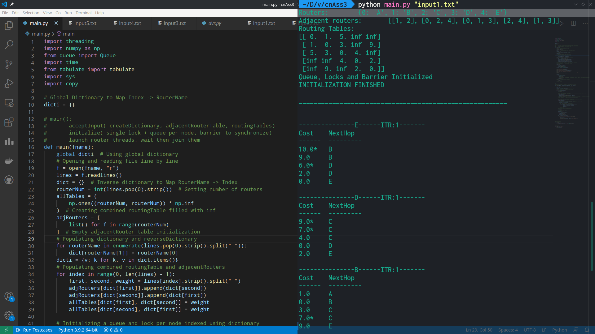
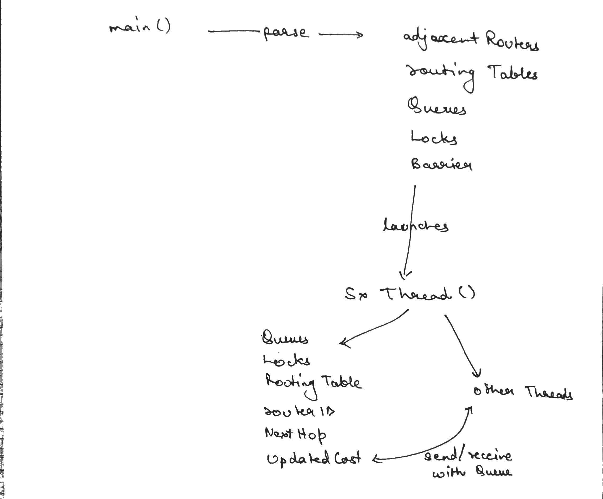
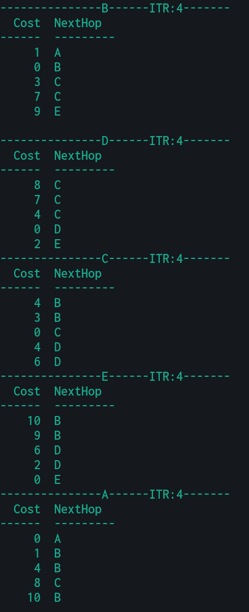
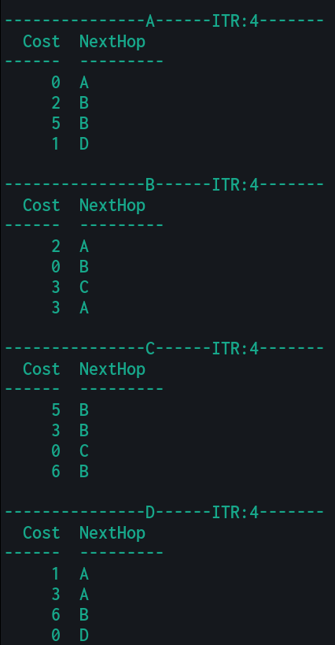
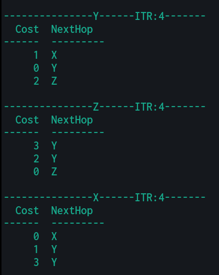
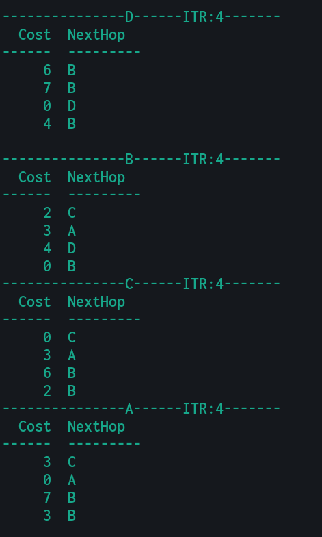
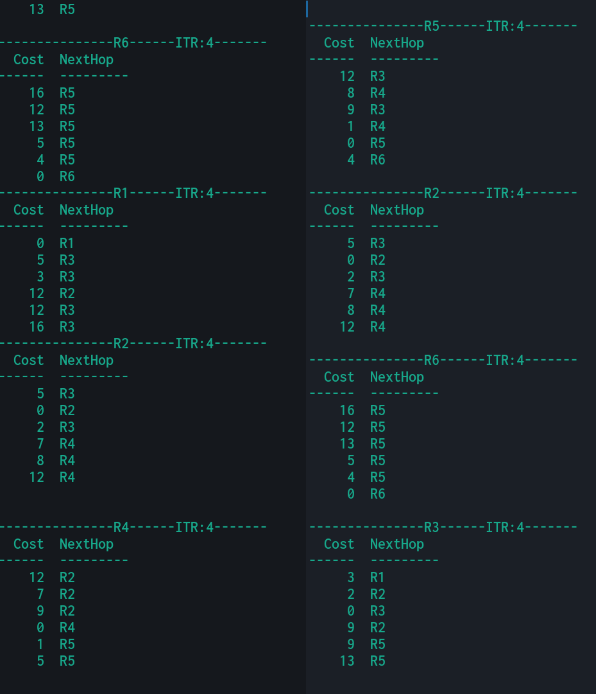
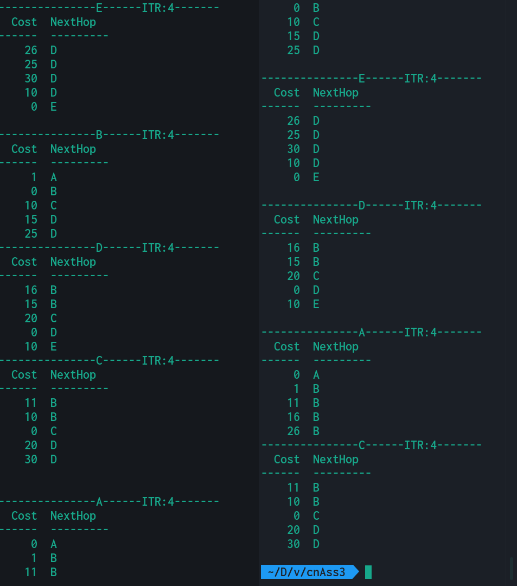

[![Contributors][contributors-shield]][contributors-url]
[![Forks][forks-shield]][forks-url]
[![Stargazers][stars-shield]][stars-url]
[![Issues][issues-shield]][issues-url]
[![MIT License][license-shield]][license-url]
[![LinkedIn][linkedin-shield]][linkedin-url]

<!-- PROJECT LOGO -->
<br />
<p align="center">
<!--   <a href="https://github.com/abhk943/dvrThread">
    
  </a> -->

  <h1 align="center">Distance Vector Routing - Python</h1>

  <p align="center">
    Simple simulation of Distant Vector Routing protocol, using python threads as routers.
    <br />
    <br />
    <a href="https://github.com/abhk943/dvrThread">View Demo</a>
    ·
    <a href="https://github.com/abhk943/dvrThread/issues">Report Bug</a>
  </p>
</p>

<!-- TABLE OF CONTENTS -->
<details open="open">
  <summary><h2 style="display: inline-block">Table of Contents</h2></summary>
  <ol>
    <li>
      <a href="#about-the-project">About The Project</a>
      <ul>
        <li><a href="#built-with">Built With</a></li>
      </ul>
    </li>
    <li>
      <a href="#getting-started">Getting Started</a>
      <ul>
        <li><a href="#prerequisites">Prerequisites</a></li>
        <li><a href="#installation">Installation</a></li>
      </ul>
    </li>
    <li><a href="#usage">Usage</a></li>
    <li><a href="#working">Working</a></li>
    <li><a href="#testing">Testing</a></li>
    <li><a href="#roadmap">Roadmap</a></li>
    <li><a href="#contributing">Contributing</a></li>
    <li><a href="#license">License</a></li>
    <li><a href="#contact">Contact</a></li>
    <li><a href="#acknowledgements">Acknowledgements</a></li>
  </ol>
</details>

<!-- ABOUT THE PROJECT -->

## About The Project



Distance Vector Routing Protocol has been implemented using python threads as routers, shared queue to transfer data between threads.
Each router maintains lists of adjacent routers, it's routing table. Periodically routers exchange information, re-calculate their costs with Bellman-Ford algorithm and print the routing table.

### Built With

- [Python](https://www.python.org)
- [Tabulate](https://pypi.org/project/tabulate/)

<!-- GETTING STARTED -->

## Getting Started

To get a local copy up and running follow these simple steps.

### Prerequisites

Install following python packages in your python environment:

- pip
  ```sh
  pip install tabulate
  ```

### Installation

1. Clone the repo:
   ```sh
   git clone https://github.com/abhk943/dvrThread.git
   ```

<!-- USAGE EXAMPLES -->

## Usage

Run the below command in your command line terminal to launch the program:


<!-- WORKING -->

## Working



- main():
  - creates
    1. routingTable
    2. adjacentRouter table
    3. queues
    4. locks
    5. barrier
    6. dictionary and reverse dicionary
  - launches
    - router threads with arguments
  - waits for threads to finish and join
- router():
_ waits(5)
_ sendsData 1. acquires lock corresponding to queue to send 2. queue.put( routingTable, routerId) 3. releases lock
_ waits for all threads to synchronize
_ receivesData 1. receives data from queue 2. re-calculates self routingTable
_ waits for all threads to synchronize
_ prints log
<!-- TESTING -->

## Testing

[test1.txt](./tests/input1.txt)

```
5
A B C D E
A B 1
A C 5
B C 3
C D 4
B E 9
D E 2
EOF
```



[test2.txt](./tests/input2.txt)

```
4
A B C D
A B 2
B C 3
C D 11
A D 1
D B 7
EOF
```



[test3.txt](./tests/input3.txt)

```
3
X Y Z
X Y 1
X Z 5
Y Z 2
EOF
```



[test4.txt](./tests/input4.txt)

```
4
C A D B
C A 3
C B 2
A B 3
A D 8
D B 4
EOF
```



[test5.txt](./tests/input5.txt)

```
6
R1 R2 R3 R4 R5 R6
R1 R2 6
R1 R3 3
R3 R2 2
R3 R5 9
R2 R4 7
R5 R4 1
R5 R6 4
R6 R4 8
EOF
```



[test6.txt](./tests/input6.txt)

```
5
A B C D E
A B 1
B C 10
C D 20
D E 10
B D 15
A E 50
EOF
```



<!-- ROADMAP -->

## Roadmap

See the [open issues](https://github.com/abhk943/dvrThread/issues) for a list of proposed features (and known issues).

<!-- CONTRIBUTING -->

## Contributing

Contributions are what make the open source community such an amazing place to be learn, inspire, and create. Any contributions you make are **greatly appreciated**.

1. Fork the Project
2. Create your Feature Branch (`git checkout -b feature/AmazingFeature`)
3. Commit your Changes (`git commit -m 'Add some AmazingFeature'`)
4. Push to the Branch (`git push origin feature/AmazingFeature`)
5. Open a Pull Request

<!-- LICENSE -->

## License

Distributed under the MIT License. See `LICENSE` for more information.

<!-- CONTACT -->

## Contact

Your Name - [@abhk943](https://twitter.com/abhk943) - abhk943@gmail.com

Project Link: [https://github.com/abhk943/dvrThread](https://github.com/abhk943/dvrThread)

<!-- ACKNOWLEDGEMENTS -->

## Acknowledgements

- [geeksforgeeks/distance-vector-routing](https://www.geeksforgeeks.org/distance-vector-routing-dvr-protocol/)
- [geeksforgeeks/bellman-ford-algorithm](https://www.geeksforgeeks.org/bellman-ford-algorithm-dp-23/)
- [geeksforgeeks/barrier-python](https://www.geeksforgeeks.org/barrier-objects-python/)

<!-- MARKDOWN LINKS & IMAGES -->
<!-- https://www.markdownguide.org/basic-syntax/#reference-style-links -->

[contributors-shield]: https://img.shields.io/github/contributors/abhk943/dvrThread.svg?style=for-the-badge
[contributors-url]: https://github.com/abhk943/dvrThread/graphs/contributors
[forks-shield]: https://img.shields.io/github/forks/abhk943/dvrThread.svg?style=for-the-badge
[forks-url]: https://github.com/abhk943/dvrThread/network/members
[stars-shield]: https://img.shields.io/github/stars/abhk943/dvrThread.svg?style=for-the-badge
[stars-url]: https://github.com/abhk943/dvrThread/stargazers
[issues-shield]: https://img.shields.io/github/issues/abhk943/dvrThread.svg?style=for-the-badge
[issues-url]: https://github.com/abhk943/dvrThread/issues
[license-shield]: https://img.shields.io/github/license/abhk943/dvrThread.svg?style=for-the-badge
[license-url]: https://github.com/abhk943/dvrThread/blob/master/LICENSE.txt
[linkedin-shield]: https://img.shields.io/badge/-LinkedIn-black.svg?style=for-the-badge&logo=linkedin&colorB=555
[linkedin-url]: https://linkedin.com/in/abhk943
